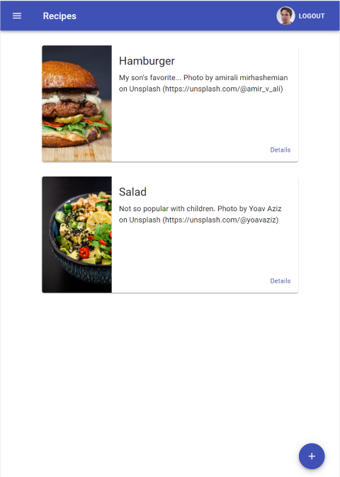

# Nanodegree Cloud Developer - Capstone project

This is my capstone project for the Nanodegree Cloud Developer.
It uses the [Serverless](https://www.serverless.com/) framework to create a set of AWS Lambda 
functions. These functions provide the backend for a [React](https://reactjs.org)
application that allow the user to create a list of recipes.
The user can optionally upload an image for a recipe. Users have
to register and login to see and edit recipes. Authentication is
handled using [Auth0](https://auth0.com).



## For reviewers

The backend is deployed to AWS Lambda and the webapp is configured
to access this deployed API. Please clone the repository into a 
new directory and use the following commands to install the required
dependencies and start the webapp on your machine:

```shell
cd client
yarn
yarn start
```

## Getting started

### Prerequisites

You need an AWS account and must have the AWS CLI installed on your machine
if you want to deploy the backend yourself.

You also need an account at Auth0.

### Installation and deployment

- Clone the repository into a directory of your choice.
- Update `backend/serverless.yml` with your Auth0 domain (variable `AUTH_0_JWKS_URL`).
  You will also need to change the name of the S3 Bucket (`IMAGES_S3_BUCKET`).
- Run `yarn install` in the sub-folders `backend` and `client` to install the dependencies.
- To deploy the backend to AWS, use `yarn run deploy`
in the folder `backend`.
- The serverless framework will log the APIs base URL to the console if deployment was successful.
  Update the API URL in `client/src/config.ts` accordingly. Change the
  Auth0 domain and clientId as well.
- To start the webapp, use `yarn start` in the folder `client`.
